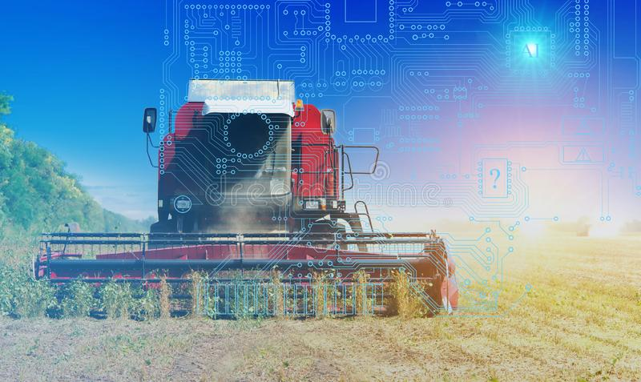

# Agricultural Futures

## Project planning and setup
- What environment do we want to work in? 
    - Jupyter, Google Colab, or AWS SageMaker
- Determine where we pull our source data
    - [CME DataMine](https://www.cmegroup.com/market-data/datamine-historical-data.html#)
    - [Nasdaq Data Link (Quandl)](https://data.nasdaq.com/)
    - Need to look at continuous contracts
    - All have different expirations
- Load in and clean data: 
    - HE - lean hogs
    - ZC - corn
    - ZM - soybean meal
    - LE - live cattle
    - GF - feeder cattle

## Considered other variables
- Weather/rainfall
- Oil/natural gas prices
- Corn prices rising because of demand abroad for ethanol

## Project Goals
- Maximize for profit
- Farmers are looking to hedge
- Farmers need to determine quantity of corn to purchase

## Usage Instructions
- 

## Time-series analysis
- Filter out noise
- Forecast returns using ARMA - output & plot
- Forecast settle price using ARIMA - output & plot
- Forecast volatility using GARCH - output & plot

## Classification
- Split data into train and test
- Scale the training and testing data
- Resample the data with the balanced random forest classifier 
- Display confusion matrix and print reports	
- Train the classifier and calculate the balanced accuracy score
- Display confusion matrix and print reports

## Sentiment analysis
- Research best sources for in-depth industry knowledge - Twitter? 
- LSTM Stock Predictor 

## Technical Requirements
- Create our slideshow presentation
    - PowerPoint, Keynote or Google Slides
- Summarize our conclusions and predictions
- Optional, apply a dimensionality reduction technique to reduce the input features, or perform feature engineering to generate new features to train the model
- Create one or more machine learning models.
- Fit the model(s) to the training data.
- Evaluate the trained model(s) using testing data. Include any calculations, metrics, or visualizations needed to evaluate the performance
- Show the predictions using a sample of new data. Compare the predictions if more than one model is used.
- Save PNG images of your visualizations to distribute to the class and instructional team for inclusion in our presentation and our repo's README.md
- Use one new machine learning library, machine learning model, or evaluation metric that hasn't been covered in class
- Create a README.md in your repo with a write-up summarizing your project. Be sure to include any usage instructions to set up and use the model

### Resources:
- [CME DataMine](https://www.cmegroup.com/market-data/datamine-historical-data.html#)
- [Nasdaq Data Link (Quandl)](https://data.nasdaq.com/)
- [USDA - National Agricultural Statistics Services](https://www.nass.usda.gov/)
- [USDA Economic Research Service](https://www.ers.usda.gov/publications/?page=1&topicId=0&authorId=0&seriesCode=LDPM&sort=CopyrightDate&sortDir=desc)
- [CME Institute](https://www.cmegroup.com/education.html?utm_source=pardot&utm_medium=email&utm_campaign=student_nurture&utm_content=20200930_graduated#)
- [Hog Feeding Spreads](https://www.cmegroup.com/trading/agricultural/files/AC-379_HogFeedingWhitePaper_r2.pdf)
- [Trading Opportunities in Lean Hogs](https://www.cmegroup.com/education/whitepapers/trading-opportunities-in-lean-hogs.html)
- [Niche Pork Production](https://www.ipic.iastate.edu/publications/840.feedbudgets.pdf)
- [Soybean Crush Synthetic Futures](https://www.cmegroup.com/markets/agriculture/oilseeds/soybean-crush.contractSpecs.html)
- [Tri-State Livestock News](https://www.tsln.com/news/cattle-futures-101-fundamentals-of-industry-marketing-tool-explained/#:~:text=There%20are%20two%20types%20of,the%20point%20of%20harvest%20weight)
- [Nasdaq Continuous Futures](https://data.nasdaq.com/databases/SCF/documentation)
- [RJO Futures - Lean Hog Futures](https://rjofutures.rjobrien.com/futures-markets/agriculturals/lean-hog-futures)